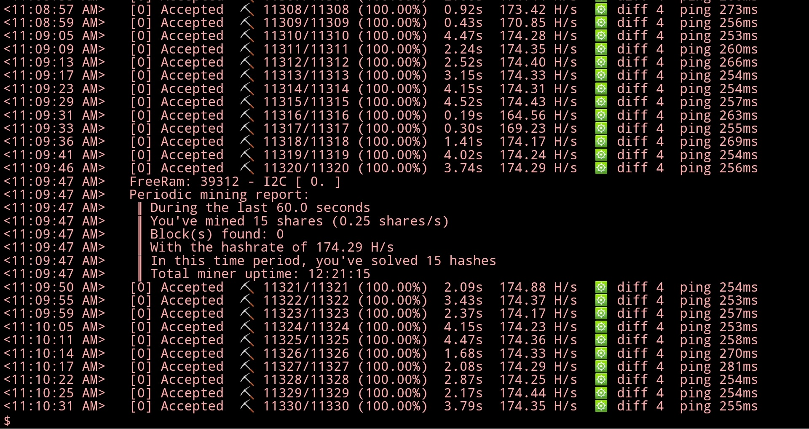
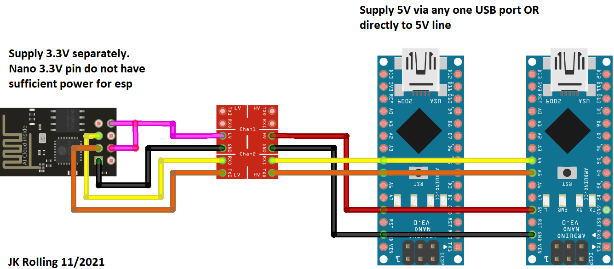

# DuinoCoinI2C

This project design to mine [Duino-Coin](https://github.com/revoxhere/duino-coin) using an Esp8266/Esp32 as a master and Arduino as a slave. 

Using the I2C communication to connect all the boards and make a scalable communication between the master and the slaves.

Visit youtube for video of [How to Make the DuinoCoinI2C Mining Rig](https://youtu.be/ErpdIaZk9EI)

## Version

DuinoCoinI2C Version 3.3

# Arduino - Slave

All Slaves have the same code and should select the I2C Address automatically if `#define I2CS_FIND_ADDR` is set to `true`

Arduino shall use [DuinoCoin_RPI_Tiny_Slave](https://github.com/JK-Rolling/DuinoCoinI2C_RPI/tree/main/DuinoCoin_RPI_Tiny_Slave) sketch

# RP2040 - Slave

RP2040 support dual core dual I2C. Dual core is counted as 2 workers

RP2040 shall use [DuinoCoin_RPI_Pico_DualCore](https://github.com/JK-Rolling/DuinoCoinI2C_RPI/tree/main/DuinoCoin_RPI_Pico_DualCore)

Set the value below to 8 and false in the ESP and RP2040 sketch
```C
// ESP
#define REPEATED_WIRE_SEND_COUNT 8      // 1 for AVR, 8 for RP2040

// RP2040
#define CRC8_EN false
```

# ATTiny - Slave

ATTiny85 is tested to be working. You may try other ATTiny chip (modification maybe needed)

ATTiny shall use [DuinoCoin_ATTiny_Slave](https://github.com/JK-Rolling/DuinoCoinI2C_RPI/tree/main/DuinoCoin_ATTiny_Slave)

## Library Dependency

* [ArduinoUniqueID](https://github.com/ricaun/ArduinoUniqueID) (Handle the chip ID)
* [StreamJoin](https://github.com/ricaun/StreamJoin) (StreamString for AVR)

## Automatic I2C Address 

The I2C Address on the Arduino is automatically updated when the board starts, if an Address already exists on the I2C bus the code finds another Address to use (with `I2CS_FIND_ADDR` enabled).
However, depending on vendor, some cloned Arduino have a pretty bad random number generator. It causes it to either wait too long or clashes with each other during address assignment. So this feature is strongly **NOT RECOMMENDED**

Instead use manual address assignment, change the value on the define for each device **(RECOMMENDED)**
```C
#define DEV_INDEX 0  // increment 1 per device
#define I2CS_START_ADDRESS 1
```

# Esp8266/Esp32 - Master

The master requests the job on the `DuinoCoin` server and sends the work to the slave (Arduino).

After the job is done, the slave sends back the response to the master (Esp8266/Esp32) and then sends back to the `DuinoCoin` server.

## Library Dependency

* [ArduinoJson](https://github.com/bblanchon/ArduinoJson) (Request Pool Version 2.6)
* [ESPAsyncWebServer](https://github.com/me-no-dev/ESPAsyncWebServer) (ESPAsyncWebServer)
* [ESPAsyncTCP](https://github.com/me-no-dev/ESPAsyncTCP) (ESP8266)
* [AsyncTCP](https://github.com/me-no-dev/AsyncTCP) (ESP32)

## Max Client/Slave

The code supports 10 clients and can be changed on the define:

```
#define CLIENTS 10
```

Note: Community reported share rate will not improve beyond 5 slaves

## AsyncWebserver

Optional. AsyncWebServer allow user to get Master status, print pool info or force switch to specific pool.

Connect to the Master via local IP address. Example address: `192.168.0.2`

| Link | Description |
|:---| :--- |
|http://192.168.0.2/ | show Serial monitor |
|http://192.168.0.2/heap | show free memory | 
|http://192.168.0.2/clients| show connected slaves|
|http://192.168.0.2/printPool| print Pool address and port |
|http://192.168.0.2/updatePool| force refresh pool address|
|http://192.168.0.2/set?host=123.123.123.123&port=123|force pool address to `123.123.123.123` and port to `123`|
|http://192.168.0.2/printMOTD|print pool message|


## Periodic Report

Optional. AsyncWebServer allow user to get periodic mining report via any Internet browser. e.g. Chrome/Firefox/Safari/etc

Upload `data` folder by using corresponding data upload tool

https://github.com/esp8266/arduino-esp8266fs-plugin

https://github.com/me-no-dev/arduino-esp32fs-plugin

Connect to the Master via local IP address. Example address: `192.168.0.2`

Change reporting interval by modifying `#define REPORT_INTERVAL 60000`




# Connection Pinouts

Connect the pins of the Esp01, Esp8266 or Esp32 on the Arduino like the table/images below, use a [Logic Level Converter](https://www.sparkfun.com/products/12009) to connect between the ESP and Arduino.

|| ESP8266 | ESP32 | Logic Level Converter | Arduino |
|:-:| :----: | :----: | :-----: | :-----: |
||3.3V | 3.3V | <---> | 5V |
||GND | GND | <---> | GND |
|`SCL`|D1 (GPIO5) | GPIO22 | <---> | A5 |
|`SDA`|D2 (GPIO4) | GPIO21 | <---> | A4 |


**ESP01**
|| ESP01 | Logic Level Converter | Arduino |
|:-:| :----: | :-----: | :-----: |
||3.3V | <---> | 5V |
||GND | <---> | GND |
|`SCL`| GPIO2 | <---> | A5 |
|`SDA`| GPIO0 | <---> | A4 |

Uncomment `#define ESP01 true`


## Custom PCB

[ericddm](https://github.com/ericddm) shared this amazing pcb!


---

Do you like this project? Please [star this project on GitHub](https://github.com/ricaun/DuinoCoinI2C/stargazers)!
